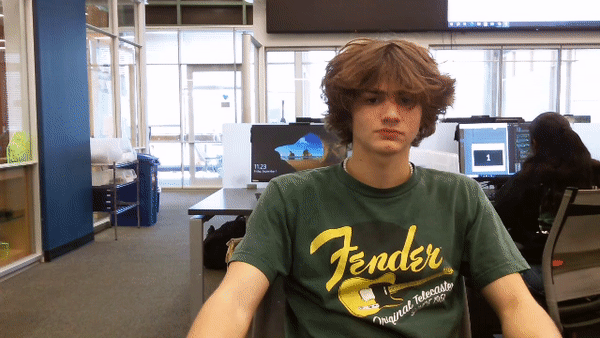

# CircuitPython
This repository will actually serve as an aid to help you get started with your own template.  You should copy the raw form of this readme into your own, and use this template to write your own.  If you want to draw inspiration from other classmates, feel free to check [this directory of all students!](https://github.com/chssigma/Class_Accounts).
## Table of Contents
* [Table of Contents](#TableOfContents)
* [Hello_CircuitPython](#Hello_CircuitPython)
* [CircuitPython_Servo](#CircuitPython_Servo)
* [CircuitPython_LCD](#CircuitPython_LCD)
* [CircuitPython Distance Sensor ](#CircuitPython Distance Sensor )
* [Motor control](#Motor control)
* [NextAssignmentGoesHere](#NextAssignment)
---

## Hello_CircuitPython

### Description & Code Snippets
Write a couple sentences here, describing this assignment, and make sure that you hit these two points:
* What was the goal of the assignment?
* How did you accomplish that goal?
  How you accomplished the goal is NOT a reflection, it is you telling the reader how to do this assignment, in broad strokes.

  Your description is the right place to draw the reader's attention to any important chunks of code. Here's how you make code look like code:

```python
Code goes here

```

**Lastly, please end this section with a link to your code or file.**  

### Evidence
Pictures / Gifs of your finished work should go here.  You need to communicate what your thing does.
For making a GIF, I recommend [ezgif.com](https://www.ezgif.com) Remember you can insert pictures using Markdown or HTML to insert an image.


And here is how you should give image credit to someone if you use their work:

Image credit goes to [Rick A](https://www.youtube.com/watch?v=dQw4w9WgXcQ&scrlybrkr=8931d0bc)


### Wiring
Make an account with your Google ID at [tinkercad.com](https://www.tinkercad.com/learn/circuits), and use "TinkerCad Circuits to make a wiring diagram."  It's really easy!  
Then post an image here.   [here's a quick tutorial for all markdown code, like making links](https://guides.github.com/features/mastering-markdown/)

### Reflection
Don't just tell the reader what went wrong or was challenging!  Describe how you figured it out, share the things that helped you succeed (tutorials, other people's repos, etc.), and then share what you learned from that experience.  **Your underlying goal for the reflection, is to concisely pass on the RIGHT knowledge that will help the reader recreate this assignment better or more easily.  Pass on your wisdom!**


## CircuitPython_Servo

### Description & Code Snippets
Write a couple sentences here, describing this assignment, and make sure that you hit these two points:
* What was the goal of the assignment?
* How did you accomplish that goal?
  How you accomplished the goal is NOT a reflection, it is you telling the reader how to do this assignment, in broad strokes.

  Your description is the right place to draw the reader's attention to any important chunks of code. Here's how you make code look like code:

```python
Code goes here

```

**Lastly, please end this section with a link to your code or file.**  


### Evidence
Pictures / Gifs of your finished work should go here.  You need to communicate what your thing does.
For making a GIF, I recommend [ezgif.com](https://www.ezgif.com) Remember you can insert pictures using Markdown or HTML to insert an image.


Here is how you should give image credit to someone if you use their work:

Image credit goes to [Rick A](https://www.youtube.com/watch?v=dQw4w9WgXcQ&scrlybrkr=8931d0bc)


### Wiring
[tinkercad.com](https://www.tinkercad.com/learn/circuits).  If you can't find the particular part you need, get creative, and just drop a note into the circuit diagram, explaining.
For example, I use an Arduino Uno to represent my Circuitpython device but write a note saying which board I'm actually using.
Then post an image here.   [Here's a quick tutorial for all markdown code, like making links](https://guides.github.com/features/mastering-markdown/)

### Reflection
Don't just tell the reader what went wrong or was challenging!  Describe how you figured it out, share the things that helped you succeed (tutorials, other people's repos, etc.), and then share what you learned from that experience.  **Your underlying goal for the reflection, is to concisely pass on the RIGHT knowledge that will help the reader recreate this assignment better or more easily.  Pass on your wisdom!**


## CircuitPython_LCD

### Description & Code Snippets
Write a couple sentences here, describing this assignment, and make sure that you hit these two points:
* What was the goal of the assignment?
* How did you accomplish that goal?
  How you accomplished the goal is NOT a reflection, it is you telling the reader how to do this assignment, in broad strokes.

  Your description is the right place to draw the reader's attention to any important chunks of code. Here's how you make code look like code:

```python
Code goes here

```

**Lastly, please end this section with a link to your code or file.**  


### Evidence
Pictures / Gifs of your finished work should go here.  You need to communicate what your thing does.
For making a GIF, I recommend [ezgif.com](https://www.ezgif.com) Remember you can insert pictures using Markdown or HTML to insert an image.


And here is how you should give image credit to someone if you use their work:

Image credit goes to [Rick A](https://www.youtube.com/watch?v=dQw4w9WgXcQ&scrlybrkr=8931d0bc)


### Wiring
[tinkercad.com](https://www.tinkercad.com/learn/circuits).  If you can't find the particular part you need, get creative, and just drop a note into the circuit diagram, explaining.
For example, I use an Arduino Uno to represent my Circuitpython device but write a note saying which board I'm actually using.
Then post an image here.   [Here's a quick tutorial for all markdown code, like making links](https://guides.github.com/features/mastering-markdown/)


### Reflection
Don't just tell the reader what went wrong or was challenging!  Describe how you figured it out, share the things that helped you succeed (tutorials, other people's repos, etc.), and then share what you learned from that experience.  **Your underlying goal for the reflection, is to concisely pass on the RIGHT knowledge that will help the reader recreate this assignment better or more easily.  Pass on your wisdom!**


## CircuitPython Servo

### Description & Code Snippets
* Get a 180° micro servo to slowly sweep back and forth between 0 and 180°.   
* Spicy part: Now control the servo with 2 buttons. 
The servo only moves if you are pushing a button.

### Code
```python
while True:
    print(button.value)
    if button.value:  # Button is pressed (remember, we're assuming it's pull-down)
        print("btn1 pressed \t")
        print(current_angle)
        current_angle = current_angle + 10
        current_angle = max(0, min(360, current_angle))
        my_servo.angle = current_angle  # Set the new angle
    time.sleep(0.05)  # Small delay to avoid excessive checking

    print(button2.value)
    if button2.value:  # Button is pressed (remember, we're assuming it's pull-down)
        print("btn2 pressed \t")
        print(current_angle)
        current_angle = current_angle - 10
        current_angle = max(0, min(360, current_angle))
        my_servo.angle = current_angle  # Set the new angle
    time.sleep(0.05)  # Small delay to avoid excessive checking

```

[circuitpython servo](Servo.py)
### Evidence

### Wiring



[tinkercad.com](https://www.tinkercad.com/learn/circuits).  If you can't find the particular part you need, get creative, and just drop a note into the circuit diagram, explaining.
For example, I use an Arduino Uno to represent my Circuitpython device but write a note saying which board I'm actually using.
Then post an image here.   [Here's a quick tutorial for all markdown code, like making links](https://guides.github.com/features/mastering-markdown/)
### Reflection


## CircuitPython Distance Sensor 

### Description & Code Snippets
In this assignment we are supposed to combine new knowlage and prior knowlage from last year by making a ultrasonic sensor that controls a RBG LED. We will do this by combining the LED code and saying when a distance is then change the color. THe goal is to get it to change from red up close to blue in the middle and green far way.

#### code
```python
from rainbowio import colorwheel
import neopixel
import time
import board
import adafruit_hcsr04
sonar = adafruit_hcsr04.HCSR04(trigger_pin=board.D3, echo_pin=board.D2)


NUMPIXELS = 6  # Update this to match the number of LEDs.
BRIGHTNESS = 0.2  # A number between 0.0 and 1.0, where 0.0 is off, and 1.0 is max.
PIN = board.NEOPIXEL  # This is the default pin on the 5x5 NeoPixel Grid BFF.

RED = (255, 0, 0)
YELLOW = (255, 150, 0)
GREEN = (0, 255, 0)
CYAN = (0, 255, 255)
BLUE = (0, 0, 255)
PURPLE = (180, 0, 255)

pixels = neopixel.NeoPixel(PIN, NUMPIXELS, brightness=BRIGHTNESS, auto_write=False)

print("starting up...")
while True:
    try:
        print((sonar.distance,))
        cm = sonar.distance
        print(cm)
        if cm < 5:
            pixels.fill(RED) 
        elif cm > 35:
            pixels.fill(GREEN)
        else:
          pixels.fill(BLUE)
        pixels.show()
    except RuntimeError:
        print("Retrying!")
    time.sleep(0.1)    
```

https://github.com/JoshBricker30/Engineering3/blob/main/lib/DistanceSensor.py
### Evidence

#### Reflection
This code was difficult until i understood that the distance sensor is just saying print the value that its picking up anyway. Then to set the colors on the neopixle from my old code to save myself a step. I then figured out that the code was simply saying if the distance is more or less then a certain value activate this color. And now when putting it all together and adding a few tweaks made it work.


### Wiring


## Motor control

### Description & Code Snippets
The goal of this assignment is to wire a DC motor to a metro board with a 9v battery pack without burning out any of the wires. Then the code was simple all it was is getting the dc motor to simply turn on and to be able to control it through a potentiomotor.

```python
import time 
import board
from analogio import AnalogIn
import pwmio
from digitalio import DigitalInOut

#pins
potentiometerpin = AnalogIn(board.A0)
motorpin = pwmio.PWMOut(board.D7)

#prints the potentiometer value then writes it to the motor
while True:
    print(potentiometerpin.value)
    time.sleep(0.1)
    motorpin.duty_cycle = potentiometerpin.value
```
[circuitpython DistanceSensor](DistanceSensor.py)
**Lastly, please end this section with a link to your code or file.**  

### Evidence

### Wiring


  

### Reflection
For this assingment i enjoyed the coding becuase it was very easy. But the wiring on the other hand was not easy at all it reqiured a lot of extra percaution since there was a lot of electricity flowing threw and could have burned something out. What made it so difficultis the placement of all the resisors along with all the extra potentiemotor wiring.


## Onshape_Hanger_Assignment

### Assignment Description

This was our first assigenment being back at onshape and we had to design a simple hanger. This was our first practice part for the onshape exam aswell. This is mostly a warmup assigment that gives us reminders of onshape skills.
### Evidence


### Part Link 

[Create a link to your Onshape document]
https://cvilleschools.onshape.com/documents/be93d5075161051205e997e4/w/d2c856fb1567cf9c57654302/e/1a54adff2da9b8ab0c5bcce5?renderMode=0&uiState=6529600c9cf7365098a3501e

### Reflection

This assignment was a great reminder For Hoe onshape worked and a good warm up. It felt good to be back to 3d design and away from code. I liked how this included a lot of the most important onshape tools. It made me think about when to use reflections cause when i did it right i only had to do half the amount of work. And honestly the documentation for onshape makes more sense and is easier.

&nbsp;


## NextAssignment

### Description & Code Snippets
Write a couple sentences here, describing this assignment, and make sure that you hit these two points:
* What was the goal of the assignment?
* How did you accomplish that goal?
  How you accomplished the goal is NOT a reflection, it is you telling the reader how to do this assignment, in broad strokes.

  Your description is the right place to draw the reader's attention to any important chunks of code. Here's how you make code look like code:

```python
Code goes here

```
[circuitpython DistanceSensor](DistanceSensor.py)
**Lastly, please end this section with a link to your code or file.**  

### Evidence

### Wiring
[tinkercad.com](https://www.tinkercad.com/learn/circuits).  If you can't find the particular part you need, get creative, and just drop a note into the circuit diagram, explaining.
For example, I use an Arduino Uno to represent my Circuitpython device but write a note saying which board I'm actually using.
Then post an image here.   [Here's a quick tutorial for all markdown code, like making links](https://guides.github.com/features/mastering-markdown/)
### Reflection
Don't just tell the reader what went wrong or was challenging!  Describe how you figured it out, share the things that helped you succeed (tutorials, other people's repos, etc.), and then share what you learned from that experience.  **Your underlying goal for the reflection, is to concisely pass on the RIGHT knowledge that will help the reader recreate this assignment better or more easily.  Pass on your wisdom!**


## Onshape_Assignment_Template

### Assignment Description

Write your assignment description here. What is the purpose of this assignment? It should be at least a few sentences.

### Evidence

Take several cropped screenshots of your Onshape document from different angles. Try to capture all important aspects of the design. Turn off overlays that obscure the parts, such as planes or mate connectors. Your images should have captions, so the reader knows what they are looking at!  

### Part Link 

[Create a link to your Onshape document](https://cvilleschools.onshape.com/documents/003e413cee57f7ccccaa15c2/w/ea71050bb283bf3bf088c96c/e/c85ae532263d3b551e1795d0?renderMode=0&uiState=62d9b9d7883c4f335ec42021). Don't forget to turn on link sharing in your Onshape document so that others can see it. 

### Reflection

What went wrong / was challenging, how'd you figure it out, and what did you learn from that experience? Your goal for the reflection is to pass on knowledge that will make this assignment better or easier for the next person. Think about your audience for this one, which may be "future you" (when you realize you need some of this code in three months), me, or your college admission committee!

&nbsp;